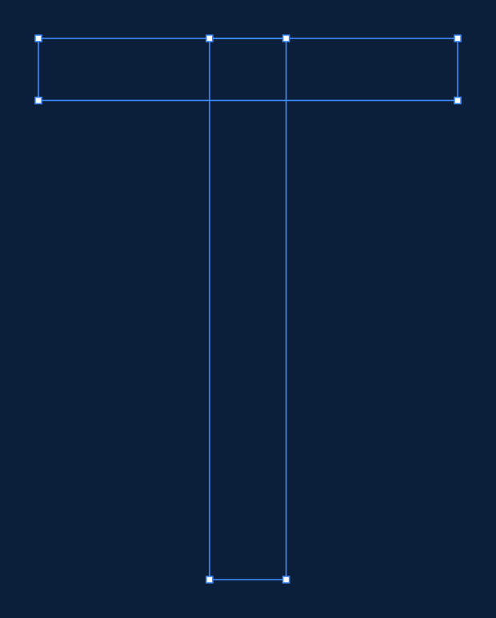
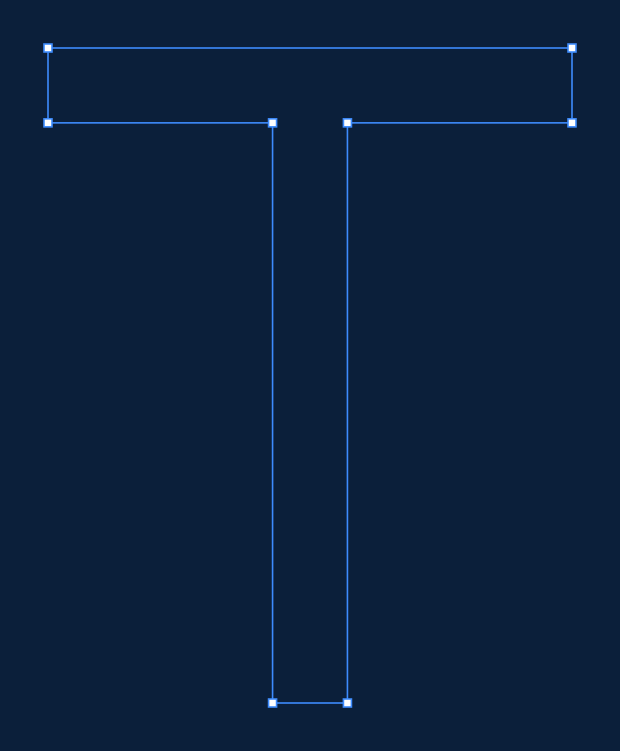

# Type Design X-Ray

Export styled **blueprint drawings of letterforms** — the outline, every
on-curve node, every off-curve bezier handle, and the handle lines between them
— straight from your font source files.

<p align="center">
  
</p>

Think of it as a batch, source-driven version of the "Bezier Inspector" family of
Illustrator plugins — except it reads your actual font file instead of tracing
placed vector art, and it sets a whole typed string at once **using the font's
real advance widths and kerning**.

Every element in the exported SVG is a real, named, editable object, so a
blueprint can go straight into Illustrator, Figma or After Effects and be
animated.

---

## What it does

- Reads **`.glyphs`** (Glyphs 3, format 4), **`.ufo`**, **`.otf`** and **`.ttf`**
- Lays out any input string with **real advance widths and kerning**, including
  **group kerning** — the lockup matches how your font actually sets
- Draws outline, handle lines, handle points, and corner-vs-smooth on-curve nodes
- Optional **metrics overlay**: baseline, x-height, cap height, ascender,
  descender and per-glyph side bearings, with numeric labels
- Renders **open contours**, so hand-drawn centreline/skeleton layers work
- Optionally **merges overlapping shapes** (`--compound`) the way the font
  compiler does at export, so you can blueprint the finished outline
- Exports **SVG** (primary), plus PNG and PDF
- Everything visual is configurable — **85 style properties**, every one
  settable from a config file *or* the command line

## Download and set up

You need **Python 3.9 or newer**. On macOS and most Linux systems it is already
there — check by opening a terminal and running:

```bash
python3 --version
```

If that prints a version number you are ready. (On Windows, install Python from
[python.org](https://www.python.org/downloads/) and tick "Add Python to PATH",
then use `python` instead of `python3` in the commands below.)

**Step 1 — download the project.**

```bash
git clone https://github.com/ArticaVisuals/type-design-xray
cd type-design-xray
```

No `git`? Download the ZIP from the green **Code** button on GitHub, unzip it,
and `cd` into the folder instead.

**Step 2 — create an isolated environment and install.**

This keeps type-design-xray and its dependencies out of your system Python, so
nothing else on your machine is affected.

```bash
python3 -m venv .venv
.venv/bin/python -m pip install --upgrade pip
.venv/bin/python -m pip install ".[compound]"
```

On Windows the paths use backslashes: `.venv\Scripts\python -m pip install ".[compound]"`.

The `[compound]` part adds overlap removal (the `--compound` option). Leave it
off if you don't need it — plain `pip install .` works fine.

**Step 3 — check it works.** This should write an SVG and print a one-line
summary:

```bash
.venv/bin/type-design-xray examples/Roboto-Regular-subset.ufo "Type" --out blueprint.svg
```

Open `blueprint.svg` in a browser, Illustrator, or Figma.

### Activating it in later sessions

The `.venv/bin/` prefix above always works and needs no activation. If you'd
rather type just `type-design-xray` (or the short alias `tdxray`),
activate the environment first:

```bash
cd type-design-xray
source .venv/bin/activate        # Windows: .venv\Scripts\activate
type-design-xray --version
```

Run `deactivate` to leave. You'll need to activate again in each new terminal —
which is why the `.venv/bin/` form is often simpler.

### Local browser preview

The fastest way to try it. Start the preview:

```bash
.venv/bin/type-design-xray-preview
```

Then open **[http://127.0.0.1:8765/](http://127.0.0.1:8765/)** in your browser
and choose a font file. Everything stays on your own computer: the server binds
to localhost only, and nothing is sent over the internet. (Choosing a file with
the picker copies it to a temporary folder on your machine, which is deleted
when you stop the server.) It uses the same Python parsing, layout, compounding
and SVG rendering code as the command-line tool, so what you see is what the
exporter produces. Press Ctrl-C in the terminal to stop it.

It gives you, live:

- **A file picker** — click "Choose file…" to load a `.glyphs`, `.otf`, `.ttf`
  or `.woff` file. The path box beside it still works for typing or pasting a
  path, and is the way to load a `.ufo`, which is a folder rather than a single
  file and so cannot be picked this way.
- **Colour pickers** for all twelve colours — background (with a transparent
  toggle), outline stroke and fill, handle lines, handle point fill and stroke,
  corner and smooth node fill and stroke, metric guides, and metric label text.
  Choosing a preset seeds every swatch with that preset's real values, so a
  preset is a starting point rather than a straitjacket. "Reset to preset" puts
  them back. Leave the swatches alone and the output is byte-identical to the
  plain preset.
- **Sizes and stroke weights as sliders** — handle point size and stroke,
  corner and smooth node size and stroke, outline stroke width, handle line
  width, and metric guide width. Drag to find a value by eye and the preview
  re-renders live; each slider has a number box beside it for exact entry,
  which accepts values beyond the slider's range.
- **A metric label font chooser** — pick the typeface the annotations are set
  in from the fonts actually installed on your machine, plus size, weight and
  style. Note the SVG references the font *by name* rather than embedding it, so
  a machine without that font will substitute a fallback when the file is opened
  elsewhere.
- **Granular metric toggles** — a master switch, then independent checkboxes for
  the guide *lines* and the numeric *labels*, plus one per guide (baseline,
  x-height, cap height, ascender, descender, side bearings) so you can render
  exactly the pieces you want.
- Preset, marker shape, frame mode, width, tracking, named layer, remove
  overlap and kerning, with a Download SVG button.

Use `--port` if 8765 is taken.

### Optional: PNG and PDF export

SVG export needs nothing extra. PNG and PDF need a rendering backend:

```bash
pip install "type-design-xray[raster]"
```

On macOS that also needs the Cairo system library, which Homebrew provides:

```bash
brew install cairo
```

If no backend is installed, `--format png` prints exactly what to install and
still writes the SVG.

## Quickstart

```bash
# The basic blueprint
type-design-xray MyFont.glyphs "afz" --out afz.svg

# With metric guides and numeric labels
type-design-xray MyFont.glyphs "afz" --metrics baseline,xheight,capheight,sidebearings --out afz.svg

# A different look
type-design-xray MyFont.glyphs "Rag" --preset drafting --out rag.svg

# Draw a hand-made centreline layer instead of the outline
type-design-xray MyFont.glyphs "a" --layer "Skeleton v1" --out skeleton.svg

# See what layers a glyph has
type-design-xray MyFont.glyphs --list-layers a

# PNG at a specific width
type-design-xray MyFont.glyphs "afz" --format svg,png --png-width 2400 --out afz.svg

# One file per glyph, as well as the combined lockup
type-design-xray MyFont.glyphs "afz" --per-glyph --out out/
```

Typing a glyph *name* rather than a character — useful for `&`, `.`, or
alternates — uses a leading slash, the convention type designers already know:

```bash
type-design-xray MyFont.glyphs "/ampersand/period/a.alt" --out named.svg
```

## Presets

**Every preset exports on a transparent background by default**, so a blueprint
composites straight into whatever you place it over. Set one when you want it:
`--background '#0b1f3a'`, or the swatch in the preview.

One caveat: `contrast` is designed for a dark backdrop — its cyan outline reads
at about 1.5:1 against white, so give it a dark `--background` when you use it.

Four ship in the box. Use `--preset <name>`, or start from one in your own
config and override just what you want.

| | |
|---|---|
| **blueprint** — the signature look |  |
| **light** — for print and docs |  |
| **contrast** — presentation / accessibility |  |
| **drafting** — spec-sheet feel, translucent fill |  |

## Styling

Nothing is hard-coded. Anything you can see, you can change — from a config file
(JSON or TOML) or straight from the command line.

```bash
type-design-xray MyFont.glyphs "afz" \
  --set handles.point.shape=diamond \
  --set handles.point.size=5 \
  --set handles.line.dash=dotted \
  --set nodes.corner.shape=triangle \
  --set outline.stroke='#7dd3fc'
```

<p align="center">
  
</p>

Or put it in a file — see [`examples/style-example.toml`](examples/style-example.toml):

```bash
type-design-xray MyFont.glyphs "afz" --config examples/style-example.toml
```

`--config` and `--set` compose, in this order:

```
built-in defaults  →  preset  →  config file  →  explicit flags  →  --set
```

Run `type-design-xray --list-style-keys` to print every settable key.

### What you can control

**Handle points** — `shape` (circle, square, diamond, triangle, cross, none),
`size`, `fill`, `stroke`, `stroke_width`, `hollow`, `opacity`, `visible`.

**Handle lines** — `color`, `width`, `dash` (solid, dashed, dotted, dashdot),
`opacity`, `visible`.

**On-curve nodes** — independent `corner` and `smooth` marker styles with the
same full set of properties, plus `distinguish_types` to switch the
corner/smooth distinction off entirely.

**Outline** — `stroke`, `width`, `dash`, `linecap`, `linejoin`, plus an optional
translucent `fill`.

Every line is exported as a real SVG `stroke` with a `stroke-width` — never
converted to an outlined, filled shape — so strokes stay live and re-editable
after import into Illustrator, Figma or After Effects.

**Metrics** — which guides to draw, their line style, and full control over the
label typeface: `label_family`, `label_size`, `label_weight`, `label_style`,
`label_variant`, `label_letter_spacing`, `label_color`, `label_opacity`. There
are shorthand flags too:

```bash
type-design-xray MyFont.glyphs "afz" --metrics all \
  --label-font "Helvetica Neue, sans-serif" --label-weight 600 --label-size 13
```

**Canvas** — `background`, `width`, `padding`, and
`frame`: `auto` fits the drawing, `metrics` locks to descender–ascender, and
`em` locks to a box exactly one em tall sitting on the descender. The locked
modes give every render an identical scale, which is what you want when
exporting a whole character set.

**Layers** — `background`, `metrics`, `fill`, `outline`, `handle_lines`,
`handle_points`, `nodes`, each independently on or off.

## Compounded outlines (`--compound`)

Glyphs sources store letterforms as separate **overlapping shapes** — an `f` is
typically a stem-and-arch shape with the crossbar laid across it as its own
rectangle. The font compiler merges those at export. `--compound` does the same
thing, so you can blueprint the finished outline instead of the construction:

```bash
type-design-xray MyFont.glyphs "f" --compound --out f.svg
```

<p align="center">
  
  
</p>

Left: the source, two overlapping contours. Right: compounded, one contour with
new nodes where the crossbar meets the stem.

`--remove-overlap` is an alias for the same option. It needs the extra:

```bash
pip install "type-design-xray[compound]"
```

This uses `skia-pathops`, the same engine `fontmake` uses for overlap removal,
so results match a real export. Two things worth knowing:

- **Open contours are never merged.** A boolean union is meaningless on an open
  centreline, so open paths pass through untouched and your `Skeleton v1`-style
  layers are safe.
- **Node types at new intersections are inferred, not authored.** Merging
  invents nodes that don't exist in your source. Nodes that survive at their
  original coordinates keep their real smooth/corner flags; only the new ones
  are inferred. The exported OTF has exactly the same limitation.

Without `--compound` you see the shapes as you actually drew them, which is
usually what you want when reviewing construction.

## Motion design: After Effects and Illustrator

Illustrator and After Effects name imported layers from SVG `id` attributes, so
every element gets a readable, unique name:

```
outline_01a_c01_path              the first contour of glyph 1 ("a")
handleline_01a_c01_n03_out        node 3's outgoing handle line
handlepoint_01a_c01_n03_out       the handle point at its end
node_01a_c02_n01_smooth           an on-curve node, tagged smooth or corner
```

Each contour is also wrapped in its own group, so it arrives as one selectable
object you can precompose. Import the SVG into Illustrator, save as `.ai`, then
import that into After Effects as a **Composition — Retain Layer Sizes** to get
the whole structure as named layers.

Importing several blueprints into one project? Namespace them so ids can't
collide:

```bash
type-design-xray MyFont.glyphs "a" --id-prefix "shotA-" --out shotA.svg
```

Elements also carry `data-glyph`, `data-node-index`, `data-node-type`,
`data-handle` and `data-contour-index` attributes if you'd rather drive things
by script.

## Layers in the source file (`.glyphs` / `.ufo`)

By default the tool reads the **finalized master layer**. Glyphs files also hold
backup layers (timestamp names like `Jul 2, 26 at 12:18`) and your own named
layers.

```bash
type-design-xray MyFont.glyphs --list-layers a     # what's available
type-design-xray MyFont.glyphs "a" --layer "Skeleton v1"
```

Open, unclosed contours are fully supported — a centreline layer draws as an
open path and is never filled:

<p align="center">
  
</p>

Glyphs absent from a named layer quietly fall back to their master layer, so a
partially-drawn layer still renders a full string.

## Python API

For batching over a character set:

```python
from typedesignxray import blueprint, blueprint_to_files, load_font

svg = blueprint("MyFont.glyphs", "afz", preset="blueprint")

font = load_font("MyFont.glyphs")
for name, glyph in font.glyphs.items():
    if glyph.unicodes:
        blueprint_to_files(
            "MyFont.glyphs", chr(glyph.unicodes[0]),
            out=f"out/{name}.svg", formats=("svg",),
        )
```

`load_font` returns the internal representation described in
[`docs/CONTRACT.md`](docs/CONTRACT.md) — raw font units, absolute handle
coordinates, one curve type — if you want to do your own drawing.

`blueprint_to_files` accepts `svg`, `png`, and `pdf` in any order and returns
the paths it wrote in that same order. An existing directory (or a path ending
in `/`) receives files named from the input text. A file path names the combined
lockup; with `per_glyph=True`, the individual glyph files are written beside
it. PNG and PDF calls raise an actionable error when no optional rendering
backend is installed; the command-line tool additionally preserves an SVG
fallback in that case.

## Known limitations

- **OTF/TTF lose node-type fidelity.** Compiled outlines are final filled
  contours and carry no smooth-vs-corner metadata. The tool infers smoothness
  from handle colinearity, which is close but not authoritative. For exact node
  types, use `.glyphs` or `.ufo`. Compiled fonts also often carry extra points
  at curve extrema that the source did not have.
- **Layer selection is a source-format feature.** `--layer` works for `.glyphs`
  and `.ufo` only; compiled fonts have a single outline.
- **Kerning from compiled fonts is partial.** The legacy `kern` table and simple
  GPOS pair positioning are read; complex contextual kerning is not applied.
  `.glyphs` kerning, including group kerning, is read exactly.
- **Variable fonts** render their default instance. Named instances and axis
  positions are not yet selectable.
- **Metric labels use a system font stack.** SVG output looks the same
  everywhere the font is present; PNG/PDF rasterisation depends on the backend
  finding it. Set `metrics.label_family` to something you know is installed if
  it matters.
- **PNG/PDF need a backend.** See the install section. SVG never does.

## Reproducing the examples

Two fonts ship in [`examples/`](examples/), and between them they cover
everything shown above.

**[`Roboto-Regular-subset.ufo`](examples/Roboto-Regular-subset.ufo)** — the
letterforms in most of the images. A four-glyph excerpt (`T y p e`) of Roboto
Regular, taken from its own UFO sources. Roboto's sources keep the overlapping
construction a designer draws: `T` really is a stem rectangle crossed by a bar,
and `y` is two overlapping strokes. That is what makes it a good subject for
`--compound` — the shipped Roboto TTF has already had those merged, so the
source is the interesting artefact. It also carries authored smooth/corner node
data, which a compiled font cannot.

```bash
type-design-xray examples/Roboto-Regular-subset.ufo "Type" --compound \
  --metrics baseline,xheight,capheight,sidebearings --out examples/output/hero.svg
```

**[`BlueprintDemo.glyphs`](examples/BlueprintDemo.glyphs)** — a small
public-domain font written for this project, used for the features Roboto's
excerpt cannot show. It deliberately exercises the awkward cases: an open
`Skeleton v1` centreline layer, contours whose handles wrap around the start of
the point list, flat pair kerning, group kerning, and an explicit zero-value
pair that has to override a group kern.

```bash
type-design-xray examples/BlueprintDemo.glyphs "a" --layer "Skeleton v1" \
  --out examples/output/skeleton-layer.svg
```

### Roboto attribution

Roboto is Copyright 2011 Google Inc., licensed under the
[Apache License 2.0](https://www.apache.org/licenses/LICENSE-2.0). The excerpt
here is redistributed with its outline data unchanged — only contours that
existed solely to carry anchor positions were removed — under the terms of that
licence. See [`examples/Roboto-Regular-subset.ufo/NOTICE.txt`](examples/Roboto-Regular-subset.ufo/NOTICE.txt).
Type Design X-Ray itself is MIT; the bundled excerpt keeps its own licence.

## Development

```bash
python3 -m venv .venv
.venv/bin/python -m pip install -e ".[dev]"
.venv/bin/python -m pytest
```

Architecture and the rules each layer relies on are in
[`docs/CONTRACT.md`](docs/CONTRACT.md); contribution notes are in
[`CONTRIBUTING.md`](CONTRIBUTING.md).

## License

MIT — see [LICENSE](LICENSE).
