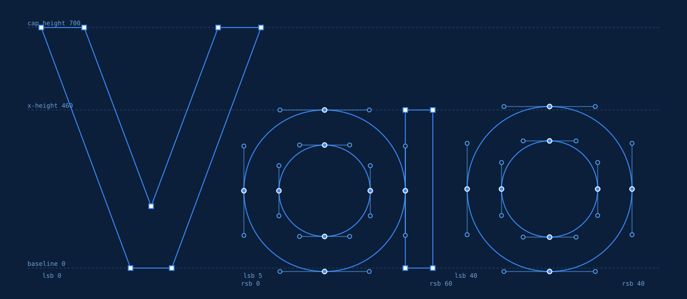
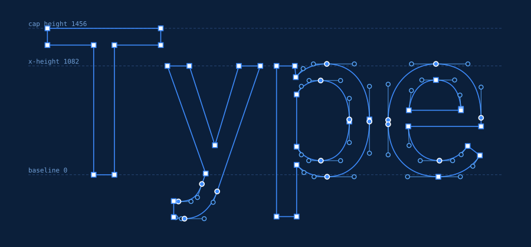
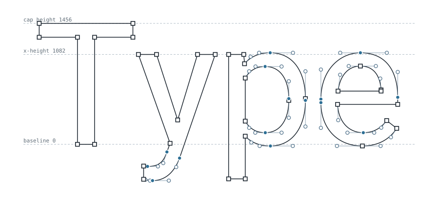
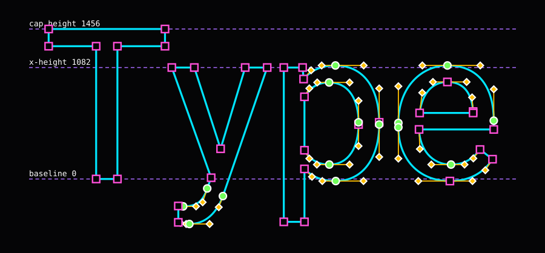
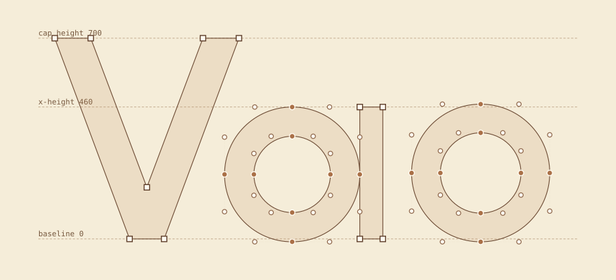
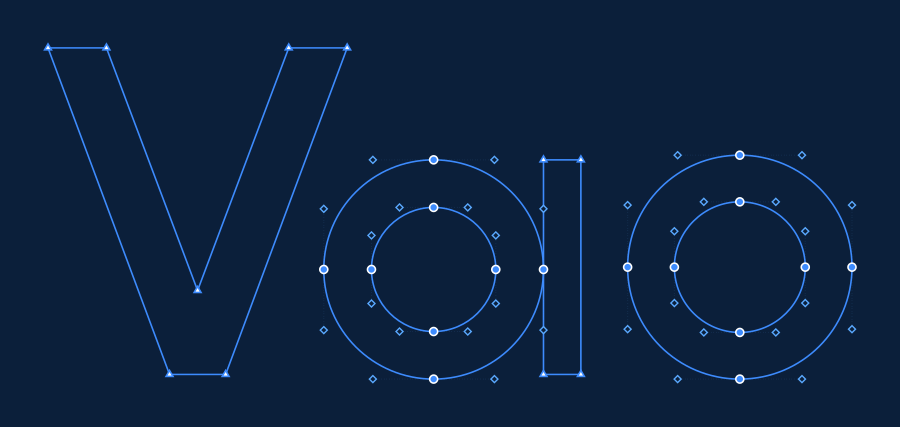
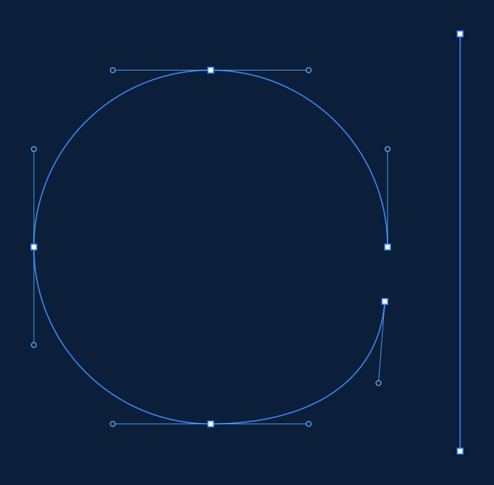

# glyphblueprint

Export styled **blueprint drawings of letterforms** — the outline, every
on-curve node, every off-curve bezier handle, and the handle lines between them
— straight from your font source files.

<p align="center">
  
</p>

Think of it as a batch, source-driven version of the "Bezier Inspector" family of
Illustrator plugins — except it reads your actual font file instead of tracing
placed vector art, and it sets a whole typed string at once **using the font's
real advance widths and kerning**.

Every element in the exported SVG is a real, named, editable object, so a
blueprint can go straight into Illustrator, Figma or After Effects and be
animated.

---

## What it does

- Reads **`.glyphs`** (Glyphs 3, format 4), **`.ufo`**, **`.otf`** and **`.ttf`**
- Lays out any input string with **real advance widths and kerning**, including
  **group kerning** — the lockup matches how your font actually sets
- Draws outline, handle lines, handle points, and corner-vs-smooth on-curve nodes
- Optional **metrics overlay**: baseline, x-height, cap height, ascender,
  descender and per-glyph side bearings, with numeric labels
- Renders **open contours**, so hand-drawn centreline/skeleton layers work
- Exports **SVG** (primary), plus PNG and PDF
- Everything visual is configurable — **77+ style properties**, every one
  settable from a config file *or* the command line

## Install

You need **Python 3.9 or newer**. Check with `python3 --version`.

```bash
pip install git+https://github.com/micahhoang/glyphblueprint
```

Or from a local clone:

```bash
git clone https://github.com/micahhoang/glyphblueprint
cd glyphblueprint
pip install .
```

Smoke test — this should write an SVG and print a one-line summary:

```bash
glyphblueprint examples/BlueprintDemo.glyphs "Vao" --out blueprint.svg
```

### Optional: PNG and PDF export

SVG export needs nothing extra. PNG and PDF need a rendering backend:

```bash
pip install "glyphblueprint[raster]"
```

On macOS that also needs the Cairo system library, which Homebrew provides:

```bash
brew install cairo
```

If no backend is installed, `--format png` prints exactly what to install and
still writes the SVG.

## Quickstart

```bash
# The basic blueprint
glyphblueprint MyFont.glyphs "afz" --out afz.svg

# With metric guides and numeric labels
glyphblueprint MyFont.glyphs "afz" --metrics baseline,xheight,capheight,sidebearings --out afz.svg

# A different look
glyphblueprint MyFont.glyphs "Rag" --preset drafting --out rag.svg

# Draw a hand-made centreline layer instead of the outline
glyphblueprint MyFont.glyphs "a" --layer "Skeleton v1" --out skeleton.svg

# See what layers a glyph has
glyphblueprint MyFont.glyphs --list-layers a

# PNG at a specific width
glyphblueprint MyFont.glyphs "afz" --format svg,png --png-width 2400 --out afz.svg

# One file per glyph, as well as the combined lockup
glyphblueprint MyFont.glyphs "afz" --per-glyph --out out/
```

Typing a glyph *name* rather than a character — useful for `&`, `.`, or
alternates — uses a leading slash, the convention type designers already know:

```bash
glyphblueprint MyFont.glyphs "/ampersand/period/a.alt" --out named.svg
```

## Presets

Four ship in the box. Use `--preset <name>`, or start from one in your own
config and override just what you want.

| | |
|---|---|
| **blueprint** — the signature look |  |
| **light** — for print and docs |  |
| **contrast** — presentation / accessibility |  |
| **drafting** — spec-sheet feel, translucent fill |  |

## Styling

Nothing is hard-coded. Anything you can see, you can change — from a config file
(JSON or TOML) or straight from the command line.

```bash
glyphblueprint MyFont.glyphs "afz" \
  --set handles.point.shape=diamond \
  --set handles.point.size=5 \
  --set handles.line.dash=dotted \
  --set nodes.corner.shape=triangle \
  --set outline.stroke='#7dd3fc'
```

<p align="center">
  
</p>

Or put it in a file — see [`examples/style-example.toml`](examples/style-example.toml):

```bash
glyphblueprint MyFont.glyphs "afz" --config examples/style-example.toml
```

`--config` and `--set` compose, in this order:

```
built-in defaults  →  preset  →  config file  →  explicit flags  →  --set
```

Run `glyphblueprint --list-style-keys` to print every settable key.

### What you can control

**Handle points** — `shape` (circle, square, diamond, triangle, cross, none),
`size`, `fill`, `stroke`, `stroke_width`, `hollow`, `opacity`, `visible`.

**Handle lines** — `color`, `width`, `dash` (solid, dashed, dotted, dashdot),
`opacity`, `visible`.

**On-curve nodes** — independent `corner` and `smooth` marker styles with the
same full set of properties, plus `distinguish_types` to switch the
corner/smooth distinction off entirely.

**Outline** — `stroke`, `width`, `dash`, `linecap`, `linejoin`, plus an optional
translucent `fill`.

**Metrics** — which guides to draw, their line style, and full control over the
label typeface: `label_family`, `label_size`, `label_weight`, `label_style`,
`label_variant`, `label_letter_spacing`, `label_color`, `label_opacity`. There
are shorthand flags too:

```bash
glyphblueprint MyFont.glyphs "afz" --metrics all \
  --label-font "Helvetica Neue, sans-serif" --label-weight 600 --label-size 13
```

**Canvas** — `background` (use `none` for transparent), `width`, `padding`, and
`frame`: `auto` fits the drawing, `metrics` locks to descender–ascender, and
`em` locks to a box exactly one em tall sitting on the descender. The locked
modes give every render an identical scale, which is what you want when
exporting a whole character set.

**Layers** — `background`, `metrics`, `fill`, `outline`, `handle_lines`,
`handle_points`, `nodes`, each independently on or off.

## Motion design: After Effects and Illustrator

Illustrator and After Effects name imported layers from SVG `id` attributes, so
every element gets a readable, unique name:

```
outline_01a_c01_path              the first contour of glyph 1 ("a")
handleline_01a_c01_n03_out        node 3's outgoing handle line
handlepoint_01a_c01_n03_out       the handle point at its end
node_01a_c02_n01_smooth           an on-curve node, tagged smooth or corner
```

Each contour is also wrapped in its own group, so it arrives as one selectable
object you can precompose. Import the SVG into Illustrator, save as `.ai`, then
import that into After Effects as a **Composition — Retain Layer Sizes** to get
the whole structure as named layers.

Importing several blueprints into one project? Namespace them so ids can't
collide:

```bash
glyphblueprint MyFont.glyphs "a" --id-prefix "shotA-" --out shotA.svg
```

Elements also carry `data-glyph`, `data-node-index`, `data-node-type`,
`data-handle` and `data-contour-index` attributes if you'd rather drive things
by script.

## Layers in the source file (`.glyphs` / `.ufo`)

By default the tool reads the **finalized master layer**. Glyphs files also hold
backup layers (timestamp names like `Jul 2, 26 at 12:18`) and your own named
layers.

```bash
glyphblueprint MyFont.glyphs --list-layers a     # what's available
glyphblueprint MyFont.glyphs "a" --layer "Skeleton v1"
```

Open, unclosed contours are fully supported — a centreline layer draws as an
open path and is never filled:

<p align="center">
  
</p>

Glyphs absent from a named layer quietly fall back to their master layer, so a
partially-drawn layer still renders a full string.

## Python API

For batching over a character set:

```python
from glyphblueprint import blueprint, blueprint_to_files, load_font

svg = blueprint("MyFont.glyphs", "afz", preset="blueprint")

font = load_font("MyFont.glyphs")
for name, glyph in font.glyphs.items():
    if glyph.unicodes:
        blueprint_to_files(
            "MyFont.glyphs", chr(glyph.unicodes[0]),
            out=f"out/{name}.svg", formats=("svg",),
        )
```

`load_font` returns the internal representation described in
[`docs/CONTRACT.md`](docs/CONTRACT.md) — raw font units, absolute handle
coordinates, one curve type — if you want to do your own drawing.

## Known limitations

- **OTF/TTF lose node-type fidelity.** Compiled outlines are final filled
  contours and carry no smooth-vs-corner metadata. The tool infers smoothness
  from handle colinearity, which is close but not authoritative. For exact node
  types, use `.glyphs` or `.ufo`. Compiled fonts also often carry extra points
  at curve extrema that the source did not have.
- **Layer selection is a source-format feature.** `--layer` works for `.glyphs`
  and `.ufo` only; compiled fonts have a single outline.
- **Kerning from compiled fonts is partial.** The legacy `kern` table and simple
  GPOS pair positioning are read; complex contextual kerning is not applied.
  `.glyphs` kerning, including group kerning, is read exactly.
- **Variable fonts** render their default instance. Named instances and axis
  positions are not yet selectable.
- **Metric labels use a system font stack.** SVG output looks the same
  everywhere the font is present; PNG/PDF rasterisation depends on the backend
  finding it. Set `metrics.label_family` to something you know is installed if
  it matters.
- **PNG/PDF need a backend.** See the install section. SVG never does.

## Reproducing the examples

Everything above is generated from
[`examples/BlueprintDemo.glyphs`](examples/BlueprintDemo.glyphs), a small
public-domain demo font included in this repo. It deliberately exercises the
awkward cases: an open `Skeleton v1` centreline layer, contours whose handles
wrap around the start of the point list, flat pair kerning, group kerning, and
an explicit zero-value pair that has to override a group kern.

```bash
glyphblueprint examples/BlueprintDemo.glyphs "Vao" \
  --metrics baseline,xheight,capheight,sidebearings --out examples/output/hero.svg
```

## Development

```bash
python3 -m venv .venv
.venv/bin/python -m pip install -e ".[dev]"
.venv/bin/python -m pytest
```

Architecture and the rules each layer relies on are in
[`docs/CONTRACT.md`](docs/CONTRACT.md); contribution notes are in
[`CONTRIBUTING.md`](CONTRIBUTING.md).

## License

MIT — see [LICENSE](LICENSE).
